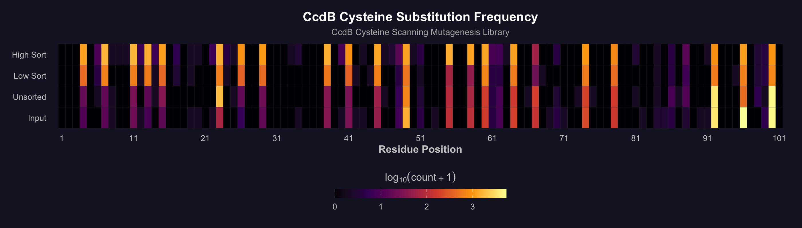
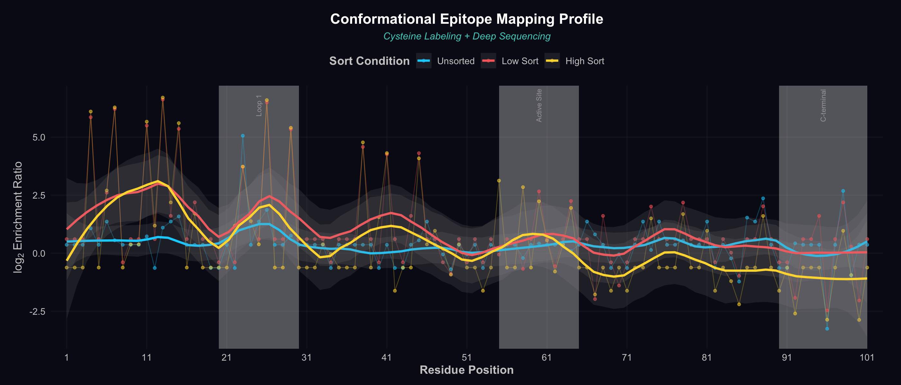
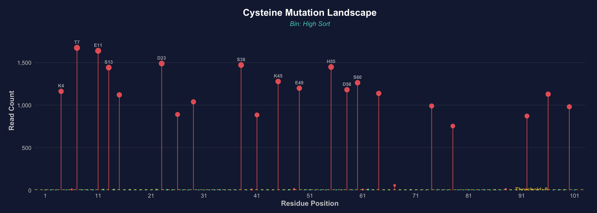

# CysingerR 

<!-- badges: start -->
[](https://github.com/go2bean/CysingerR)
[](https://opensource.org/licenses/MIT)
[](https://cran.r-project.org/)
<!-- badges: end -->

**CysingerR** is an R package for analyzing deep sequencing data from **cysteine scanning mutagenesis** libraries. A tool that uses cysteine as a molecular probe to "sing out" which positions are on a protein's surface. It ports and enhances the [original Perl pipeline](https://github.com/skshrutikhare/cys_library_analysis) from [Najar et al. (*Structure*, 2017)](https://doi.org/10.1016/j.str.2017.06.015) into a single, easy-to-use R package with publication-quality visualizations.

## Overview

Cysteine scanning mutagenesis systematically replaces each amino acid in a protein with cysteine, then uses thiol-reactive fluorescent probes and FACS sorting to identify **surface-exposed** vs. **buried** residues. This technique enables:

- 🎯 **Conformational epitope mapping** — identify where antibodies bind
- 💊 **Drug target surface mapping** — find druggable pockets
- 🏗️ **Structural topology** — determine surface accessibility without crystallography
- 🧬 **Protein engineering** — identify permissive sites for modifications

CysingerR provides the complete computational pipeline: from raw FASTQ reads to normalized enrichment ratios and publication-ready figures.

## Installation

```r
# Install from GitHub
# install.packages("devtools")
devtools::install_github("go2bean/CysingerR")

# Or install from a local source
install.packages("path/to/Cysinger_1.0.0.tar.gz", repos = NULL, type = "source")
```

### Dependencies

**Required** (installed automatically):

- `ggplot2` (≥ 3.4.0), `dplyr`, `tidyr`, `patchwork`, `scales`, `rlang`

**Optional** (for full pipeline functionality):

```r
# Bioconductor packages for alignment
if (!requireNamespace("BiocManager", quietly = TRUE))
    install.packages("BiocManager")
BiocManager::install(c("Biostrings", "ShortRead"))
```

## Quick Start

```r
library(Cysinger)

# Load built-in CcdB example data
cys_data <- load_example_data("residue_level")

# Normalize: calculate enrichment ratios
cys_norm <- normalize_cys_frequency(cys_data, input_bin = 1, sorted_bins = 2:4)

# Generate figures
plot_cys_heatmap(cys_data, bin_labels = c("Input", "Unsorted", "Low Sort", "High Sort"))
plot_epitope_profile(cys_norm, bin_labels = c("Unsorted", "Low Sort", "High Sort"))
plot_mutation_landscape(cys_data, bin_to_plot = 4, bin_label = "High Sort")
```

## Figures

Cysinger generates **7 publication-quality visualizations** with a premium dark theme:

### Heatmap — Global view of cysteine substitution frequencies



Shows read counts across all protein positions (x-axis) and sorting bins (y-axis) using a log-scaled inferno color palette.

### Epitope Mapping Profile — The key publication figure



Loess-smoothed enrichment profiles across the protein sequence with highlighted structural regions. Peaks indicate surface-exposed positions; valleys indicate buried positions.

### Mutation Landscape — Top hit identification



Lollipop plot showing read counts per position with automatic labeling of the most enriched positions.

### QC Dashboard — Data quality assessment


Four-panel composite: total reads per bin, read count distributions, inter-bin correlation heatmap, and most variable positions.

### Enrichment Bar Plot — Detailed per-position counts


Grouped bar chart showing raw read counts for each position, colored by sorting bin.

### Surface Accessibility Radar — Circular topology map


Polar plot classifying each position as surface-accessible (red) or buried (teal) based on enrichment.

### Mutation Classification Donut — Library quality


Donut chart showing the proportion of WT, single-mutant, double, triple, and multi-mutant reads.

## Full Pipeline

For processing raw FASTQ data end-to-end:

```r
results <- run_pipeline(
  fwd_fastq  = "reads_forward.fastq",
  rev_fastq  = "reads_reverse.fastq",
  wt_seq     = ccdB_wt_nucleotide(),
  mid_tags   = c("ACGAGT", "ACGCTG", "AGACTG"),
  primers    = c("ATGCAG", "TTCAGG"),
  n_bins     = 4L,
  min_quality = 20L,
  min_length  = 75L
)

# Access results
results$cys_normalized       # Enrichment ratios
results$classification       # Mutation class summary
results$combine_stats        # Read merging QC
```

### Pipeline Steps

| Step | Function | Replaces Perl Script |
|------|----------|---------------------|
| 1 | `filter_fastq_reads()` | `initial_filter_fwd.pl`, `initial_filter_rev.pl` |
| 2 | `demultiplex_reads()` | `bin_all_fwd.pl`, `bin_all_rev.pl`, `import_bins.pl` |
| 3 | `quality_filter_reads()` | `filter_scores_Q20.pl` |
| 4 | `reads_to_fasta()` | `Convert2Fasta.pl`, `revComp_Convert2Fasta.pl` |
| 5 | `align_to_reference()` | `run_water_fwd.pl`, `run_water_rev.pl` |
| 6 | `combine_paired_reads()` | `combine_all.pl` |
| 7 | `build_substitution_table()` | `get_substitution_table.pl` |
| 8 | `classify_mutations()` | `classify_substitutions.pl` |
| 9 | `calculate_cys_frequency()` | `get_CYS_freq.pl` |
| 10 | `normalize_cys_frequency()` | `get_CYS_freq_reslevel.pl` + normalization |

## Utility Functions

```r
# Genetic code and sequence tools
get_codon_table()                        # Standard genetic code (64 codons)
translate_sequence("ATGTGTAAATGA")       # "MCK*"
reverse_complement_seq("ATGC")           # "GCAT"

# Wild-type CcdB reference
ccdB_wt_nucleotide()                     # 306 nt sequence
ccdB_wt_protein()                        # 102 aa (101 + stop)
```

## Example Data

The package includes CcdB cysteine scanning data from [Najar et al., 2017](https://doi.org/10.1016/j.str.2017.06.015):

```r
# Residue-level cysteine frequencies (101 positions × 4 bins)
cys_data <- load_example_data("residue_level")

# Wild-type CcdB FASTA sequence
wt_seq <- load_example_data("wt_sequence")

# Pre-normalized dataset (ready for plotting)
cys_norm <- generate_example_normalized()
```

## Citation

If you use Cysinger in your research, please cite:

> Najar TA, Khare S, Suresh R, Pandey S, Raghavan V, Bhatt TK. Mapping protein binding sites and conformational epitopes using cysteine scanning and deep sequencing. *Structure*. 2017;25(3):395-405. doi: [10.1016/j.str.2017.06.015](https://doi.org/10.1016/j.str.2017.06.015)

## License

MIT © TL Lee

## Contributing

Contributions are welcome! Please see [CONTRIBUTING.md](CONTRIBUTING.md) for guidelines.
